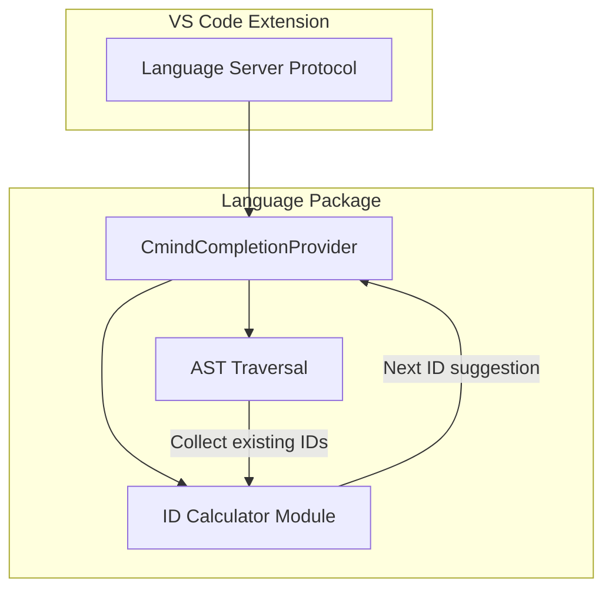

# Design Document: @id Auto-Completion

## Overview

本设计为 cmind DSL 编辑器实现 @id 属性的智能自动补全功能。当用户在节点名称后输入空格时，编辑器将自动建议 `@id(nodeXXX)` 格式的补全项，其中 XXX 是基于当前文档中已存在的最大节点 ID 数字自增 1 后的值。

该功能通过扩展 Langium 的 CompletionProvider 服务实现，利用 AST 遍历收集现有 ID，并通过纯函数计算下一个可用 ID。

## Architecture



### 组件职责

1. **CmindCompletionProvider**: 自定义补全提供器，继承 Langium 的 DefaultCompletionProvider
2. **ID Calculator Module**: 纯函数模块，负责计算下一个可用 ID
3. **AST Traversal**: 遍历 MindMap AST 收集所有现有的 @id 值

## Components and Interfaces

### 1. ID Calculator Module (`id-calculator.ts`)

```typescript
/**
 * Extracts numeric suffix from an ID string with "node" prefix
 * Returns undefined if the ID doesn't match the pattern
 */
export function extractNodeNumber(id: string): number | undefined;

/**
 * Formats a number as a node ID with proper zero-padding
 * Numbers < 1000 are padded to 3 digits (e.g., 001, 042, 999)
 * Numbers >= 1000 are not padded (e.g., 1000, 1234)
 */
export function formatNodeId(num: number): string;

/**
 * Calculates the next available node ID based on existing IDs
 * Returns "node001" if no valid numeric IDs exist
 */
export function calculateNextId(existingIds: string[]): string;

/**
 * Collects all @id attribute values from a MindMap AST
 */
export function collectExistingIds(mindMap: MindMap): string[];
```

### 2. Completion Provider (`cmind-completion-provider.ts`)

```typescript
import { DefaultCompletionProvider } from 'langium/lsp';

export class CmindCompletionProvider extends DefaultCompletionProvider {
    /**
     * Override to add custom @id completion after node text
     */
    protected override completionFor(
        context: CompletionContext,
        next: NextFeature,
        acceptor: CompletionAcceptor
    ): MaybePromise<void>;
}
```

### 3. Module Registration

在 `cmind-module.ts` 中注册自定义 CompletionProvider：

```typescript
export const CmindModule: Module<CmindServices, PartialLangiumServices & CmindAddedServices> = {
    validation: {
        CmindValidator: () => new CmindValidator()
    },
    lsp: {
        CompletionProvider: (services) => new CmindCompletionProvider(services)
    }
};
```

## Data Models

### Input Data

- **existingIds**: `string[]` - 从 AST 中收集的所有 @id 值
- **MindMap AST**: Langium 生成的 AST 结构，包含 RootNode 和 ChildNode

### Output Data

- **nextId**: `string` - 格式为 `node001`、`node042`、`node1000` 等
- **CompletionItem**: LSP 补全项，包含 label、insertText、documentation

### ID Pattern

- 前缀: `node`
- 数字部分: 
  - 1-999: 3位零填充 (001, 042, 999)
  - 1000+: 无填充 (1000, 1234)

## Correctness Properties

*A property is a characteristic or behavior that should hold true across all valid executions of a system-essentially, a formal statement about what the system should do. Properties serve as the bridge between human-readable specifications and machine-verifiable correctness guarantees.*

### Property 1: ID Calculation Correctness

*For any* list of existing ID strings, the `calculateNextId` function SHALL return a properly formatted ID string where:
- The numeric value is exactly one greater than the maximum numeric suffix found in IDs matching the `node` + digits pattern
- If no valid numeric IDs exist, the result is `node001`
- Non-numeric IDs (e.g., `nodeA`, `root001`) are ignored in the calculation

**Validates: Requirements 1.2, 1.3, 1.4, 2.1, 2.3, 4.1, 4.2**

### Property 2: ID Formatting Consistency

*For any* positive integer n, the `formatNodeId` function SHALL return:
- `node` + 3-digit zero-padded number when n < 1000 (e.g., `node001`, `node042`, `node999`)
- `node` + unpadded number when n >= 1000 (e.g., `node1000`, `node1234`)

**Validates: Requirements 1.3, 2.2**

### Property 3: Round-trip Consistency (Existing)

*For any* valid MindMap AST, printing the AST with the pretty printer and then parsing the result SHALL produce an AST that is structurally equivalent to the original.

**Validates: Requirements 4.3**

## Error Handling

| Scenario | Handling |
|----------|----------|
| Empty document (no AST) | Return default `@id(node001)` |
| No existing @id attributes | Return default `@id(node001)` |
| All existing IDs are non-numeric | Return default `@id(node001)` |
| Malformed @id values | Skip and continue processing |
| AST parsing errors | Gracefully degrade, no completion offered |

## Testing Strategy

### Property-Based Testing

使用 `fast-check` 库进行属性测试：

1. **ID Calculation Property Test**
   - 生成随机的 ID 列表（混合有效和无效格式）
   - 验证 `calculateNextId` 返回正确的下一个 ID
   - 标注: `**Feature: id-auto-completion, Property 1: ID Calculation Correctness**`

2. **ID Formatting Property Test**
   - 生成随机正整数
   - 验证 `formatNodeId` 返回正确格式的 ID
   - 标注: `**Feature: id-auto-completion, Property 2: ID Formatting Consistency**`

3. **Round-trip Property Test** (已存在)
   - 生成随机 MindMap AST
   - 验证 print → parse 产生等价 AST
   - 标注: `**Feature: id-auto-completion, Property 3: Round-trip Consistency**`

### Unit Tests

1. **Edge Cases**
   - 空 ID 列表 → `node001`
   - 单个 ID `node001` → `node002`
   - 最大 ID `node999` → `node1000`
   - 混合格式 `node1`, `node01`, `node001` → 正确计算最大值

2. **Integration Tests**
   - 补全提供器在正确位置触发
   - 补全项包含正确的 insertText

### Test Configuration

- 属性测试最少运行 100 次迭代
- 使用 vitest 作为测试框架
- 测试文件位于 `packages/language/test/` 目录
