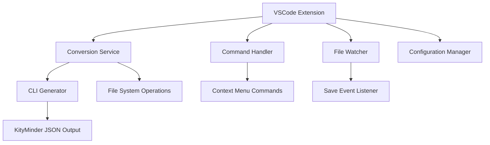

# Design Document: VSCode Auto-Convert Feature

## Overview

This design document outlines the implementation of automatic conversion and context menu features for the CMind VSCode extension. The solution integrates the existing CLI conversion functionality into the VSCode extension, providing seamless conversion from CMind DSL to KityMinder JSON format.

## Architecture

The feature extends the existing VSCode extension with the following components:



## Components and Interfaces

### 1. Conversion Service

**Purpose:** Core service that handles CMind to KityMinder JSON conversion

**Interface:**
```typescript
interface ConversionService {
    convertFile(filePath: string, outputDir?: string): Promise<ConversionResult>;
    isConversionEnabled(): boolean;
}

interface ConversionResult {
    success: boolean;
    outputPath?: string;
    error?: string;
}
```

**Implementation:** 
- Uses the existing `generateKityMinderFile` function from the CLI package
- Handles file system operations and error management
- Provides async conversion with proper error handling

### 2. Command Handler

**Purpose:** Manages VSCode commands for manual conversion

**Interface:**
```typescript
interface CommandHandler {
    registerCommands(context: vscode.ExtensionContext): void;
    executeConvertCommand(uri?: vscode.Uri): Promise<void>;
}
```

**Implementation:**
- Registers the "Convert to KityMinder JSON" command
- Handles context menu integration
- Provides user feedback through notifications

### 3. File Watcher

**Purpose:** Monitors file save events for automatic conversion

**Interface:**
```typescript
interface FileWatcher {
    startWatching(context: vscode.ExtensionContext): void;
    onFileSaved(document: vscode.TextDocument): Promise<void>;
}
```

**Implementation:**
- Listens to `onDidSaveTextDocument` events
- Filters for `.cmind` files
- Triggers conversion based on user settings

### 4. Configuration Manager

**Purpose:** Manages extension settings and user preferences

**Interface:**
```typescript
interface ConfigurationManager {
    isAutoConvertEnabled(): boolean;
    getOutputDirectory(): string | undefined;
    shouldShowNotifications(): boolean;
}
```

## Data Models

### Extension Configuration

```typescript
interface ExtensionConfig {
    autoConvertOnSave: boolean;
    outputDirectory?: string;
    showNotifications: boolean;
}
```

### Conversion Context

```typescript
interface ConversionContext {
    sourceFile: string;
    outputDirectory: string;
    showNotifications: boolean;
}
```

## Error Handling

### Error Categories

1. **Syntax Errors:** Invalid CMind DSL syntax
2. **File System Errors:** Permission issues, disk space, etc.
3. **Configuration Errors:** Invalid settings or paths

### Error Response Strategy

- Display user-friendly error messages via VSCode notifications
- Log detailed errors to the output channel for debugging
- Graceful degradation when conversion fails
- No interruption to normal editing workflow

## Testing Strategy

The testing approach combines unit tests for individual components and integration tests for the complete workflow.

### Unit Tests
- Test conversion service with various CMind DSL inputs
- Test configuration manager with different settings
- Test command handler registration and execution
- Test file watcher event handling

### Property-Based Tests
- Test conversion service with randomly generated valid CMind DSL files
- Test error handling with invalid file inputs
- Test configuration validation with various setting combinations

## Correctness Properties

*A property is a characteristic or behavior that should hold true across all valid executions of a system-essentially, a formal statement about what the system should do. Properties serve as the bridge between human-readable specifications and machine-verifiable correctness guarantees.*

### Property 1: Conversion Service Integration
*For any* valid CMind file, when the conversion service processes it, the service should use the existing CLI generator to perform the conversion.
**Validates: Requirements 1.1**

### Property 2: Output File Naming
*For any* CMind file that is successfully converted, the output file should have the same base name with a `.json` extension.
**Validates: Requirements 1.2**

### Property 3: Error Message Display
*For any* invalid CMind file that fails conversion, the conversion service should display an error message to the user.
**Validates: Requirements 1.3**

### Property 4: Output File Location
*For any* CMind file that is converted without a specified output directory, the generated KityMinder JSON file should be placed in the same directory as the source file.
**Validates: Requirements 1.4**

### Property 5: Save Event Triggering
*For any* CMind file save event when auto-conversion is enabled, the extension should trigger the conversion service.
**Validates: Requirements 2.1**

### Property 6: Background Conversion
*For any* CMind file when auto-conversion is enabled, the extension should perform conversion in the background without blocking the editor.
**Validates: Requirements 2.2**

### Property 7: Success Notification
*For any* successful conversion, the extension should display a success notification to the user.
**Validates: Requirements 2.3**

### Property 8: Disabled Auto-Conversion
*For any* CMind file save event when auto-conversion is disabled, the extension should not trigger conversion.
**Validates: Requirements 2.4**

### Property 9: Error Notification
*For any* failed conversion, the extension should display an error notification with details about the failure.
**Validates: Requirements 2.5**

### Property 10: Context Menu Command Triggering
*For any* context menu convert command selection, the extension should trigger the conversion service.
**Validates: Requirements 3.2**

### Property 11: Success Notification with Path
*For any* successful conversion via context menu, the extension should display a success notification that includes the output file path.
**Validates: Requirements 3.3**

### Property 12: File Type Menu Visibility
*For any* file that is not a CMind file (does not have `.cmind` extension), the context menu should not show the convert option.
**Validates: Requirements 3.4**

### Property 13: Default Output Directory
*For any* conversion when no output directory is specified in settings, the extension should use the same directory as the source file.
**Validates: Requirements 4.3**

### Property 14: Syntax Error Reporting
*For any* CMind file with syntax errors, the conversion service should display error messages that include location and description details.
**Validates: Requirements 5.1**

### Property 15: File System Error Handling
*For any* file system operation failure during conversion, the conversion service should display a descriptive error message.
**Validates: Requirements 5.2**

### Property 16: Automatic Directory Creation
*For any* conversion with a non-existent output directory, the conversion service should create the directory automatically.
**Validates: Requirements 5.3**

### Property 17: File Protection on Failure
*For any* conversion that fails, the extension should not overwrite or modify existing output files.
**Validates: Requirements 5.4**

**Property-Based Testing Configuration:**
- Use VSCode's testing framework with custom property test utilities
- Minimum 100 iterations per property test
- Each test tagged with: **Feature: vscode-auto-convert, Property {number}: {property_text}**